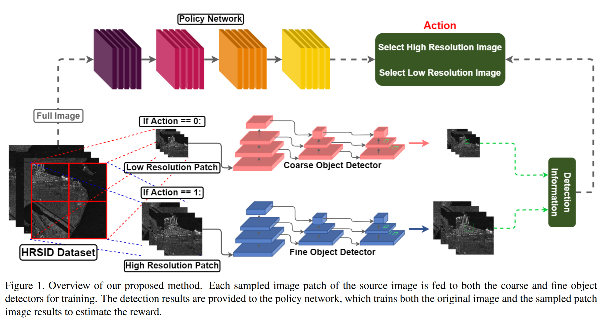

 Object Detection for SAR images

Yolov3: https://github.com/eriklindernoren/PyTorch-YOLOv3

EfficientObjectDetection: https://github.com/uzkent/EfficientObjectDetection


# SAROD: Efficient End-to-end Object Detection on SAR Images withReinforcement Learning
Anonymous WACV submission

## Overview of our framework.



## Clone
```
git clone https://github.com/anonymous-hub/SAROD
```

## Dataset
HRSID Dataset can be downloaded in [here](https://github.com/chaozhong2010/HRSID)

Pre-Processed dataset for the result can be downloaded by running the file or [TBA](TBA).

A example script for downloading the testset is as follows:
```
# Download the dataset
cd dataset
bash download_PGGAN.sh
bash download_StarGAN.sh
bash download_StyleGAN.sh
bash download_StyleGAN2.sh
bash download_PGGAN_lsun_bedroom.sh
bash download_PGGAN_lsun_bird.sh
cd ..
```

## Download pre-trained model weights
The pretrained weights can be downloaded by running the file in dataset or [TBA](TBA).

```
# Download the pre-trained weights
cd weights
bash download_weights.sh
cd ..
```

## Setup
```
pip install -r requirements.txt
```

